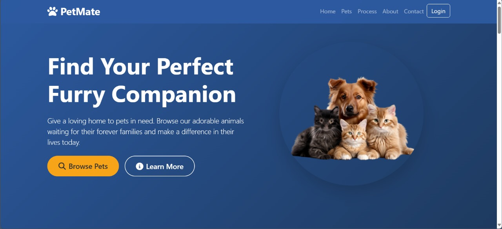
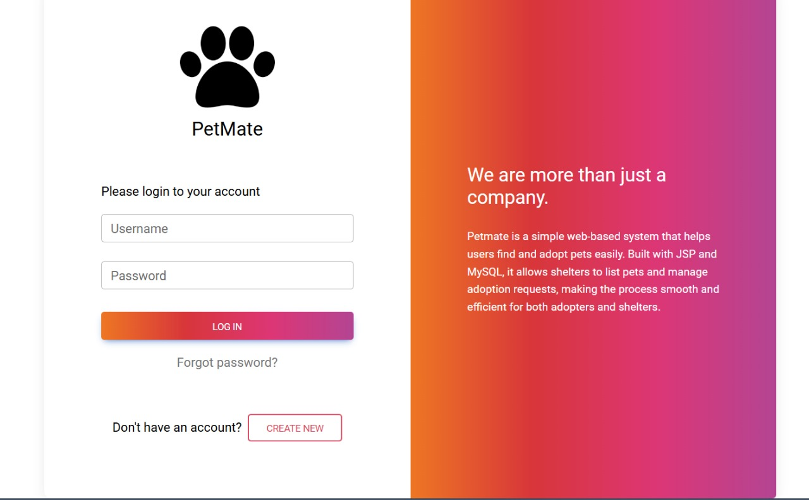
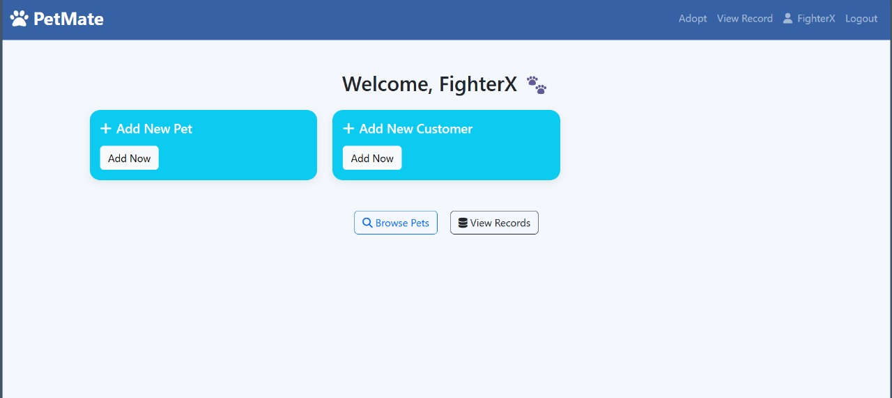
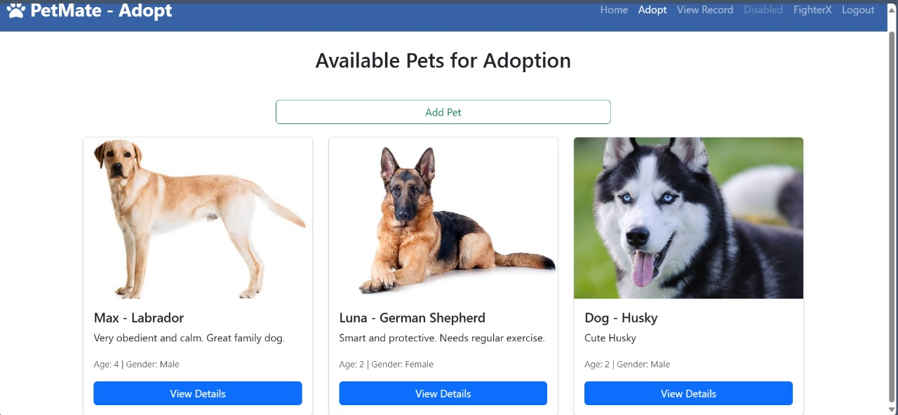
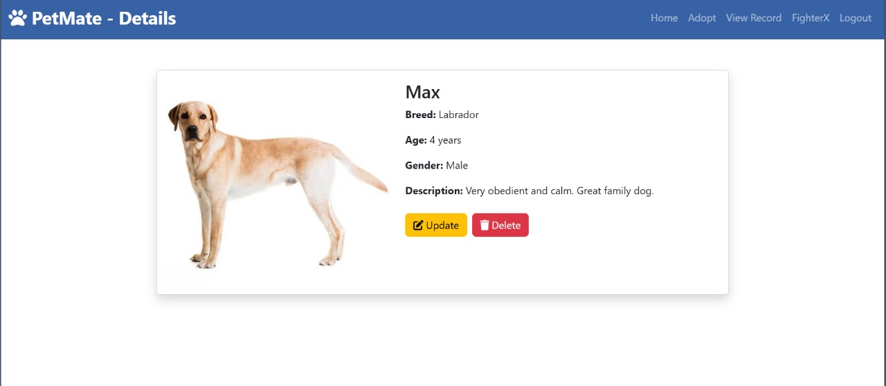
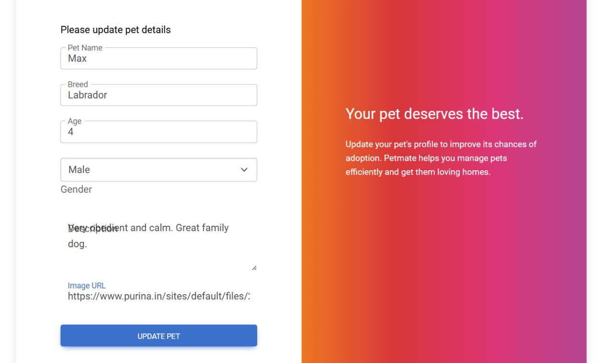
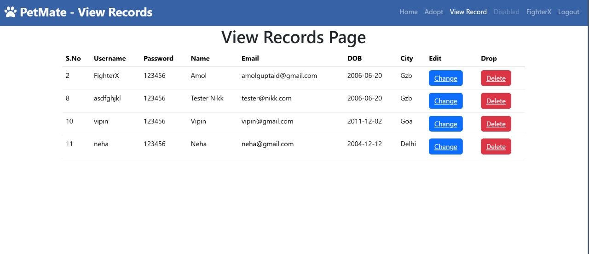

# 🐾 PetMate – Pet Adoption System

**PetMate** is a web-based pet adoption platform that helps users find and adopt pets easily.  
Built using **JSP** and **MySQL**, it allows shelters to manage pet listings and adoption records through a clean and user-friendly interface.

---

## 🚀 Features

- 🔐 User login and authentication
- 🐶 Browse pets with images and descriptions
- 📋 Add, update, and delete pet details (Admin only)
- 👤 Manage user records
- 📄 Detailed pet profiles for informed adoption
- 💻 Responsive and modern design using HTML, CSS, Bootstrap

---

## 💻 Tech Stack

- **Frontend**: HTML5, CSS3, Bootstrap
- **Backend**: JSP (Java Server Pages)
- **Database**: MySQL
- **Server**: Apache Tomcat

---

## 📸 Screenshots

### 🏠 Homepage  


### 🔐 Login Page  


### 👋 Welcome Dashboard  


### 🐕 Browse Pets  


### 📄 Pet Details  


### ✏️ Update Pet  


### 📋 User Records  


---

## 🛠️ How to Run Locally

1. **Clone the repository**
   ```bash
   git clone https://github.com/FighterX777/petmate.git
   ```

2. **Import into your IDE**
   - Use **Eclipse**, **NetBeans**, or **IntelliJ**
   - Import the project as a **Dynamic Web Project**

3. **Set up the MySQL Database**
   - Create a database named `pet_adopt`
   - Import the `pet_adopt.sql` file 

4. **Configure Database Connection**
   - Edit DB credentials in the `UserDAO` classes

5. **Run the Project**
   - Deploy the project on **Apache Tomcat Server**
   - Open your browser and go to:
     ```
     http://localhost/petmate
     ```

---

## 👤 Developer

- **Amol Gupta**  
- **Amrita Singh**

---

## 📜 License

This project is open-source and free to use for educational and non-commercial purposes.

---

## 🌟 Support

If you found this project helpful, please give it a ⭐ on GitHub and share it with others!
